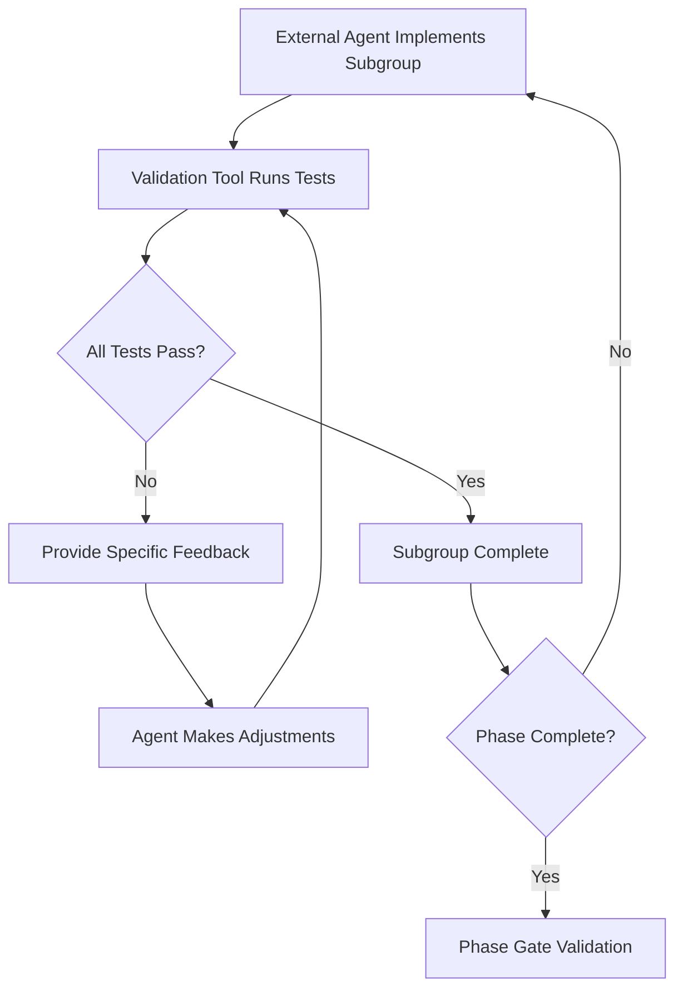

# AI-Assisted Development Planning & Test Generation Workflow
**A Generalized Methodology for Systematic Project Setup and Quality Assurance**

---

## Overview

This document describes a proven 4-phase workflow for transforming conceptual software projects into implementation-ready systems using AI-assisted development tools. The methodology combines strategic task organization, comprehensive test-driven development, and hybrid AI workflows to create systematic quality assurance and clear execution roadmaps.

### **Core Principles**
- **AI-Optimized Structure**: Workflow designed specifically for AI development capabilities
- **Quality-First Approach**: Tests define expected functionality before implementation
- **Systematic Boundaries**: Clear phases and subgroups prevent scope creep
- **Hybrid AI Utilization**: Combines strengths of different AI tools for optimal outcomes

### **Expected Outcomes**
- Complete task breakdown with sequential implementation order
- Comprehensive failing test suite providing TDD foundation
- Hybrid development methodology with quality gates
- Implementation-ready project with clear execution roadmap

---

## Phase 1: Task Organization & File Structure
**Goal**: Transform conceptual requirements into organized, sequential implementation tasks

### **Step 1: Assess Current Organization**
**Action**: Review existing project documentation and identify organizational issues

**Common Problems**:
- Confusing file naming conventions
- Tasks without clear sequence
- Missing implementation boundaries
- Unclear dependency relationships

**Documentation Review**:
- [ ] Existing task documentation
- [ ] File naming patterns
- [ ] Cross-reference consistency
- [ ] Implementation dependencies

### **Step 2: Establish Sequential Organization**
**Action**: Implement systematic file organization with clear sequencing

**File Naming Convention**:
- **Sequential Prefixes**: 01_, 02_, 03_, 04_ for immediate ordering
- **Descriptive Names**: Clear functional group identification
- **Consistent Structure**: Same pattern across all project phases

**Example Structure**:
```
project_name/
├── phase1_tasks/
│   ├── 01_foundation.md
│   ├── 02_interface.md
│   ├── 03_core_features.md
│   └── 04_infrastructure.md
├── phase2_tasks/
│   ├── 01_enhancement_area_1.md
│   ├── 02_enhancement_area_2.md
│   ├── 03_enhancement_area_3.md
│   └── 04_enhancement_area_4.md
└── phase3_tasks/
    ├── 01_advanced_feature_1.md
    ├── 02_advanced_feature_2.md  
    ├── 03_advanced_feature_3.md
    └── 04_advanced_feature_4.md
```

### **Step 3: Define Phase Structure**
**Action**: Organize project into logical development phases with clear boundaries

**Phase Definition Template**:
- **Phase 1**: Foundation/MVP (Months 1-X)
- **Phase 2**: Enhancement/Optimization (Months X-Y)
- **Phase 3**: Advanced Features/Scale (Months Y-Z)

**Subgroup Structure**:
- **4 Task Subgroups per Phase**: Manageable implementation units
- **Sequential Dependencies**: Clear order within and between phases
- **Boundary Definition**: Stopping points for validation

### **Step 4: Create Comprehensive Documentation**
**Action**: Develop complete task documentation with implementation specifications

**Documentation Requirements**:
- [ ] Phase overview files (README.md for each phase)
- [ ] Detailed task group specifications
- [ ] Cross-reference navigation links
- [ ] Technology stack confirmation
- [ ] Success criteria definition

**Task Documentation Template**:
```markdown
# Task Group Name (Tasks X-Y)
**Focus Area Description**

## Overview
Brief description of task group purpose and outcomes

## Task X: Specific Task Name
### Objective
Clear goal statement

### Key Features
- Feature requirement 1
- Feature requirement 2
- Feature requirement 3

### Implementation Steps
1. Step 1 description
2. Step 2 description
3. Step 3 description

### Acceptance Criteria
- [ ] Criterion 1
- [ ] Criterion 2
- [ ] Criterion 3

### Testing Requirements
- [ ] Test requirement 1
- [ ] Test requirement 2
```

### **Phase 1 Outcomes**
✅ **Organized Task Structure**: Clear sequential implementation order  
✅ **Complete Documentation**: All task groups documented with specifications  
✅ **Technology Stack Locked**: Architectural decisions documented  
✅ **Phase Boundaries Defined**: Clear stopping points and dependencies  

---

## Phase 2: Test-Driven Development Setup
**Goal**: Create comprehensive failing test suites that define expected functionality before implementation

### **Step 1: Adopt TDD Philosophy**
**Action**: Establish Test-Driven Development as the core development approach

**TDD Benefits**:
- Tests define expected functionality before implementation
- Failing tests guide implementation direction
- Quality gates prevent regression
- Project-specific requirements validated systematically

**TDD Cycle**:
1. **Red Phase**: Create failing tests that define expected behavior
2. **Green Phase**: Implement minimal code to make tests pass
3. **Refactor Phase**: Improve code while maintaining test compliance

### **Step 2: Establish Testing Infrastructure**
**Action**: Create organized test file structure and testing standards

**Test File Organization**:
```
project_name/
├── phase1_tasks/
│   ├── phase1_tests/
│   │   ├── 01_foundation_tests.ts
│   │   ├── 02_interface_tests.ts
│   │   ├── 03_core_features_tests.ts
│   │   └── 04_infrastructure_tests.ts
│   └── [task documentation files]
├── phase2_tasks/
│   ├── phase2_tests/
│   │   ├── 01_enhancement_1_tests.ts
│   │   ├── 02_enhancement_2_tests.ts
│   │   ├── 03_enhancement_3_tests.ts
│   │   └── 04_enhancement_4_tests.ts
│   └── [task documentation files]
└── phase3_tasks/
    ├── phase3_tests/
    │   ├── 01_advanced_1_tests.ts
    │   ├── 02_advanced_2_tests.ts
    │   ├── 03_advanced_3_tests.ts
    │   └── 04_advanced_4_tests.ts
    └── [task documentation files]
```

**Testing Standards Template**:
- **Framework**: Jest with TypeScript for type safety
- **Mocking**: Comprehensive mocking for external dependencies
- **Integration**: Cross-component interaction testing
- **Performance**: Load time and resource optimization validation
- **Security**: Authentication and data protection testing
- **Accessibility**: Compliance validation (WCAG, screen readers)

### **Step 3: Generate Comprehensive Test Suites**
**Action**: Use specialized AI testing agents to create complete failing test suites

**Testing Agent Workflow**:
1. **Task Tool Invocation**: Launch specialized testing agent (testbot-beta or equivalent)
2. **Requirements Analysis**: Agent analyzes task documentation and creates comprehensive tests
3. **Test Generation**: Agent produces complete test files with failing tests
4. **File Integration**: Write test files to organized directory structure

**Test Creation Process Per Phase**:
```markdown
## Phase X Test Creation Session

### Preparation
- [ ] Review all task documentation for phase
- [ ] Identify unique project requirements
- [ ] Determine performance benchmarks
- [ ] Define security and compliance needs

### Execution  
- [ ] Launch testing agent with phase requirements
- [ ] Generate comprehensive test suite
- [ ] Validate test coverage against task documentation
- [ ] Write test files to organized directory structure
- [ ] Update documentation with test status

### Validation
- [ ] Verify test files exist and are properly organized
- [ ] Confirm tests cover all task requirements
- [ ] Validate project-specific requirements included
- [ ] Document test coverage metrics
```

### **Step 4: Validate Test Coverage**
**Action**: Ensure comprehensive coverage of all project requirements

**Coverage Validation Checklist**:
- [ ] **Functional Coverage**: All features and capabilities tested
- [ ] **Performance Coverage**: Load times, responsiveness, scalability
- [ ] **Security Coverage**: Authentication, authorization, data protection
- [ ] **Integration Coverage**: Component interactions and data flow
- [ ] **Project-Specific Coverage**: Unique domain requirements validated

**Test Categories Template**:
- **Unit Tests**: Individual component and function testing
- **Integration Tests**: Component interaction and data flow
- **End-to-End Tests**: Complete user workflow scenarios
- **Performance Tests**: Benchmarks and optimization validation
- **Security Tests**: Authentication and data protection
- **Domain-Specific Tests**: Project-unique requirement validation

### **Phase 2 Outcomes**
✅ **Complete Test Coverage**: Comprehensive failing test suites for all phases  
✅ **TDD Foundation**: Clear implementation guidance through failing tests  
✅ **Quality Standards**: Performance, security, and domain-specific validation  
✅ **Implementation Roadmap**: Test-guided development path established  

---

## Phase 3: Hybrid Development Methodology
**Goal**: Establish systematic workflow combining external coding agents with validation tools

### **Step 1: Design Hybrid Workflow**
**Action**: Create methodology that separates implementation from validation

**Workflow Architecture**:
- **External Coding Agents**: Handle implementation of task subgroups
- **Validation Tools**: Run comprehensive test suites and provide feedback
- **Quality Gates**: No advancement without validation passage
- **Iterative Refinement**: Feedback loop for continuous improvement

**Implementation Cycle**:


### **Step 2: Create Coding Agent Instructions**
**Action**: Document clear implementation instructions for external agents

**Instruction Template Structure**:
```markdown
## IMPLEMENTATION WORKFLOW FOR PHASE X

**Your role**: Implement all Phase X tasks following TDD approach using comprehensive failing test suites.

### Subgroup 1: [Subgroup Name] (Tasks X-Y)
**Implement in order**:
1. **Task X**: Brief description
2. **Task Y**: Brief description
3. **Task Z**: Brief description

**Reference**: Use `phaseX_tests/01_subgroup_tests.ts` for expected functionality
**Stop here**: After completing Tasks X-Y, stop and wait for testing validation

### Subgroup 2: [Next Subgroup Name] (Tasks A-B)
[Similar structure for each subgroup]

### Key Implementation Guidelines
- **Principle 1**: Project-specific guideline
- **Principle 2**: Quality standard requirement
- **Principle 3**: Performance benchmark target
- **Principle 4**: Security/compliance requirement

### Testing Process (handled separately)
- Testing conducted by validation tool after subgroup completion
- Failing tests provide specific feedback for adjustments
- Do not proceed to next subgroup until current tests pass
- Next phase only begins after all current phase tests pass
```

### **Step 3: Establish Quality Gates**
**Action**: Define clear criteria that must be met before advancement

**Quality Gate Template**:
```markdown
## Phase X Completion Criteria

### Technical Requirements
- [ ] All tests passing for phase
- [ ] Performance benchmarks achieved
- [ ] Security requirements met
- [ ] Integration testing successful

### Quality Standards  
- [ ] Code coverage targets met
- [ ] Documentation updated
- [ ] Project-specific principles maintained
- [ ] Accessibility compliance validated

### Readiness Validation
- [ ] Next phase dependencies satisfied
- [ ] Team/stakeholder approval obtained
- [ ] Deployment pipeline functional
- [ ] Monitoring and alerting configured
```

**Performance Benchmarks Template**:
- **Phase 1**: Foundation performance targets (load times, basic functionality)
- **Phase 2**: Enhancement performance targets (optimization, user experience)
- **Phase 3**: Scale performance targets (enterprise, high-load scenarios)

### **Step 4: Document Complete Methodology**
**Action**: Create comprehensive methodology documentation for future reference

**Methodology Documentation Sections**:
1. **Overview**: Complete workflow description and benefits
2. **Development Workflow**: Phase structure and implementation cycles  
3. **Test-Driven Approach**: TDD integration and quality assurance
4. **Quality Gates**: Performance benchmarks and advancement criteria
5. **Benefits Analysis**: Efficiency, quality, and scalability advantages
6. **Implementation Status**: Current readiness and next steps

**Benefits Documentation Template**:
```markdown
### Methodology Benefits

#### Quality Assurance
- Systematic validation prevents regression
- Comprehensive test coverage ensures reliability
- Performance benchmarks maintain user experience
- Security testing protects data and systems

#### Development Efficiency
- Clear task boundaries reduce scope creep
- TDD approach guides implementation direction
- Automated testing reduces manual validation effort
- Iterative refinement enables continuous improvement

#### Project Alignment
- Design principles validated at each step
- User experience consistency maintained
- Domain-specific requirements thoroughly tested
- Enterprise readiness confirmed
```

### **Phase 3 Outcomes**
✅ **Hybrid Workflow Established**: Systematic development methodology with quality gates  
✅ **Agent Instructions Created**: Clear guidance for external implementation agents  
✅ **Quality Standards Defined**: Performance, security, and domain-specific benchmarks  
✅ **Methodology Documented**: Complete workflow ready for execution and replication  

---

## Phase 4: Documentation & Continuity Management
**Goal**: Establish systems for maintaining context and knowledge transfer across development sessions

### **Step 1: Create Conversation History System**
**Action**: Establish systematic documentation of planning and setup process

**History Documentation Structure**:
```
project_name/
└── conversation_history/
    ├── 01_task_organization_summary.md
    ├── 02_phase1_tests_creation_summary.md
    ├── 03_phase2_tests_creation_summary.md
    └── 04_methodology_establishment_summary.md
```

**Conversation Summary Template**:
```markdown
# Conversation Summary #0X - [Focus Area]

**Date**: [Date]
**Focus**: [Primary objective of conversation]

## Summary
Brief overview of conversation goals and outcomes

## Key Accomplishments
### 1. [Major Achievement 1]
Description of achievement and impact

### 2. [Major Achievement 2] 
Description of achievement and impact

## Technical Outcomes
- [Deliverable 1]: Description
- [Deliverable 2]: Description
- [Deliverable 3]: Description

## Files Created/Modified
- **Created**: [List of new files]
- **Updated**: [List of modified files]
- **Enhanced**: [List of improved files]

## Problem Resolution
### [Issue Encountered]
**Problem**: Description of challenge
**Solution**: How it was resolved
**Result**: Outcome achieved

## Next Steps
- [Next action 1]
- [Next action 2]
- [Next action 3]
```

### **Step 2: Establish Context Continuity Protocol**
**Action**: Create systems for maintaining project context across AI development sessions

**Compaction Protocol**:
1. **Context Monitoring**: Watch for conversation length limits
2. **Compaction Trigger**: Use `/compact` command when approaching limits
3. **Summary Creation**: Generate detailed conversation summary
4. **File Organization**: Add summary to conversation_history/ with sequential numbering
5. **Context Preservation**: Ensure key decisions and progress documented

**Context Handoff Checklist**:
- [ ] Current project status documented
- [ ] Recent accomplishments summarized
- [ ] Technical decisions recorded
- [ ] File changes cataloged
- [ ] Next steps identified
- [ ] Problem resolutions noted

### **Step 3: Create Implementation Readiness Documentation**
**Action**: Document complete project status and readiness for execution

**Readiness Documentation Template**:
```markdown
# Project Implementation Readiness Status

## Current Status: [Ready/In Progress/Blocked]

### Complete Foundation
✅ **Task Organization**: [Status and details]
✅ **Test Coverage**: [Coverage metrics and scope]
✅ **Methodology**: [Workflow status and documentation]
✅ **Documentation**: [Completeness and organization]

### Quality Gates Defined
✅ **Performance Benchmarks**: [Targets and validation methods]
✅ **Security Standards**: [Requirements and testing approach]
✅ **Domain Standards**: [Project-specific principles and validation]
✅ **Testing Framework**: [Technology and coverage standards]

### Next Phase Launch Ready
- **Phase 1 Subgroup 1**: [Readiness status and requirements]
- **External Agent Instructions**: [Documentation completeness]
- **Test Suite Reference**: [Test file availability and coverage]
- **Success Criteria**: [Definition and measurement methods]
```

### **Step 4: Create Generalized Methodology Guide**
**Action**: Extract reusable workflow from project-specific implementation

**Generalized Workflow Documentation**:
1. **Process Overview**: High-level methodology description
2. **Phase Templates**: Reusable structures for any project
3. **Tool Requirements**: AI agents and validation tools needed
4. **Quality Standards**: Performance, security, testing benchmarks
5. **Replication Guide**: Steps for applying methodology to new projects

**Methodology Replication Checklist**:
- [ ] **Project Assessment**: Requirements analysis and scope definition
- [ ] **Phase Structure**: Logical development phase organization
- [ ] **Task Breakdown**: Sequential implementation task creation
- [ ] **Test Generation**: Comprehensive failing test suite creation
- [ ] **Workflow Design**: Hybrid development methodology establishment
- [ ] **Quality Gates**: Performance and validation criteria definition
- [ ] **Documentation**: Complete guidance and context systems
- [ ] **Execution Launch**: Implementation readiness validation

### **Phase 4 Outcomes**
✅ **Context Continuity**: Systematic documentation and knowledge transfer systems  
✅ **Implementation Readiness**: Complete status documentation and launch preparation  
✅ **Methodology Replication**: Generalized workflow ready for other projects  
✅ **Knowledge Preservation**: Complete process documentation for future reference  

---

## Workflow Benefits & Applications

### **Quality Assurance Advantages**

#### **Systematic Validation**
- **Prevention Over Correction**: Tests define quality before implementation begins
- **Regression Protection**: Comprehensive coverage prevents feature degradation  
- **Performance Monitoring**: Automated benchmarks maintain optimization standards
- **Security Integration**: Data protection and authentication tested systematically

#### **Clear Development Boundaries**
- **Phase Separation**: Distinct development focuses prevent scope creep
- **Subgroup Organization**: Manageable implementation units with clear stopping points
- **Quality Gates**: No advancement without validation ensures sustainable progress
- **Sequential Dependencies**: Clear order prevents implementation conflicts

### **Development Efficiency**

#### **AI-Optimized Structure**
- **External Agent Integration**: Leverages specialized AI agents for implementation
- **Validation Tool Usage**: Uses testing capabilities for systematic quality assurance
- **Hybrid Approach**: Combines strengths of different AI development tools
- **Iterative Refinement**: Test feedback loops enable continuous improvement

#### **Documentation Continuity**
- **Context Preservation**: Systematic summaries maintain long-term project memory
- **Knowledge Transfer**: Complete documentation enables team expansion
- **Implementation Guidance**: Clear instructions for any development agent to follow
- **Methodology Replication**: Process templates applicable to other projects

### **Scalability & Enterprise Readiness**

#### **Team Development**
- **Multi-Agent Workflow**: Subgroup structure enables parallel development
- **Quality Consistency**: Central validation ensures standards maintenance
- **Role Specialization**: Different agents handle implementation vs. validation
- **Progress Tracking**: Clear metrics for advancement and completion

#### **Enterprise Integration**
- **Security Standards**: Built-in testing for authentication, authorization, compliance
- **Performance Benchmarks**: Scalability targets defined and validated
- **Documentation Standards**: Enterprise-grade process documentation and continuity
- **Quality Frameworks**: Systematic validation suitable for production environments

---

## Application Guide

### **Project Assessment Phase**
Before applying this workflow, evaluate project suitability:

**Ideal Project Characteristics**:
- Complex software development with multiple phases
- Quality assurance requirements (performance, security, user experience)
- Team development or knowledge transfer needs
- Enterprise or production deployment targets
- AI-assisted development approach

**Resource Requirements**:
- Access to AI development agents (coding, testing, documentation)
- Project stakeholders available for requirements validation
- Time allocation for comprehensive planning phase
- Commitment to systematic quality assurance process

### **Workflow Adaptation Guide**

#### **Phase Structure Customization**
```markdown
## Phase Customization Template

### Phase 1: [Foundation Phase Name]
- **Focus**: [Core infrastructure and basic functionality]
- **Duration**: [Time estimate]
- **Subgroups**: 
  1. [Foundation area 1]
  2. [Foundation area 2] 
  3. [Foundation area 3]
  4. [Foundation area 4]

### Phase 2: [Enhancement Phase Name]
- **Focus**: [Optimization and user experience improvements]
- **Duration**: [Time estimate]
- **Subgroups**:
  1. [Enhancement area 1]
  2. [Enhancement area 2]
  3. [Enhancement area 3] 
  4. [Enhancement area 4]

### Phase 3: [Advanced Phase Name]
- **Focus**: [Advanced features and enterprise readiness]
- **Duration**: [Time estimate]
- **Subgroups**:
  1. [Advanced area 1]
  2. [Advanced area 2]
  3. [Advanced area 3]
  4. [Advanced area 4]
```

#### **Technology Stack Validation**
- **Frontend**: [Framework, language, styling approach]
- **Backend**: [Database, authentication, API architecture]
- **Testing**: [Framework, coverage requirements, performance benchmarks]
- **Deployment**: [Environment, scaling, monitoring approaches]

#### **Domain-Specific Requirements**
- **Industry Standards**: [Compliance, regulatory, certification requirements]
- **Performance Targets**: [Load times, scalability, resource optimization]
- **Security Standards**: [Authentication, data protection, vulnerability management]
- **User Experience**: [Accessibility, mobile, cross-platform requirements]

### **Success Metrics Template**
```markdown
## Project Success Criteria

### Phase 1 Success Metrics
- [ ] [Metric 1]: [Target and measurement method]
- [ ] [Metric 2]: [Target and measurement method]
- [ ] [Metric 3]: [Target and measurement method]

### Phase 2 Success Metrics  
- [ ] [Metric 1]: [Target and measurement method]
- [ ] [Metric 2]: [Target and measurement method]
- [ ] [Metric 3]: [Target and measurement method]

### Phase 3 Success Metrics
- [ ] [Metric 1]: [Target and measurement method]
- [ ] [Metric 2]: [Target and measurement method] 
- [ ] [Metric 3]: [Target and measurement method]

### Overall Project Success
- [ ] [Overall metric 1]: [Definition and validation]
- [ ] [Overall metric 2]: [Definition and validation]
- [ ] [Overall metric 3]: [Definition and validation]
```

---

## Conclusion

This AI-Assisted Development Planning & Test Generation Workflow provides a systematic approach to transforming conceptual software projects into implementation-ready systems. The 4-phase methodology combines strategic organization, comprehensive testing, and hybrid AI workflows to ensure quality, efficiency, and scalability.

### **Core Methodology Benefits**

1. **Systematic Quality Assurance**: Test-driven approach ensures quality definition before implementation
2. **Clear Development Boundaries**: Phase and subgroup structure prevents scope creep and confusion
3. **AI-Optimized Workflow**: Designed specifically to leverage AI development capabilities effectively  
4. **Enterprise Readiness**: Built-in standards for performance, security, and scalability validation

### **Replication Requirements**

- **AI Tool Access**: Development agents, testing agents, validation tools
- **Process Commitment**: Systematic approach to planning and quality assurance
- **Documentation Standards**: Comprehensive project organization and continuity management
- **Quality Focus**: Performance benchmarks, security standards, domain-specific validation

### **Expected Outcomes**

Projects following this workflow will achieve:
- Complete task breakdown with sequential implementation order
- Comprehensive test coverage providing clear development guidance
- Systematic quality gates ensuring consistent validation
- Implementation-ready status with clear execution roadmap
- Scalable methodology applicable to team development and enterprise deployment

This workflow template can be adapted for any complex software development project requiring systematic quality assurance, clear development boundaries, and AI-assisted implementation approaches.